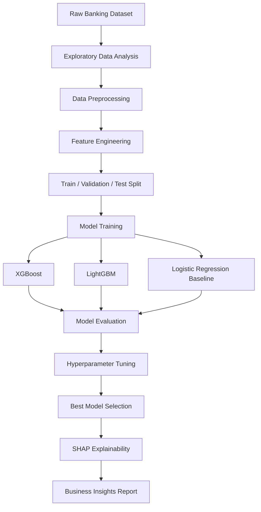

# Banking Marketing ML Classification

> End-to-end machine learning classification pipeline predicting bank marketing campaign outcomes using XGBoost, LightGBM, and SHAP-based explainability.

---

## Overview

This project builds a complete supervised ML pipeline on a banking marketing dataset to predict whether a client will subscribe to a term deposit following a direct marketing campaign. The pipeline covers data exploration, feature engineering, model training, hyperparameter tuning, and model explainability — producing business-interpretable predictions backed by SHAP feature importance analysis.

---

## System Architecture



---

## Tech Stack

| Layer | Technology |
|---|---|
| ML Models | XGBoost, LightGBM, Logistic Regression |
| Explainability | SHAP (SHapley Additive exPlanations) |
| Data Processing | Pandas, NumPy |
| Visualization | Matplotlib, Seaborn |
| Model Selection | Scikit-learn (cross-validation, GridSearchCV) |
| Language | Python |

---

## Dataset

**Bank Marketing Dataset** (UCI Machine Learning Repository)  
- 45,211 records, 16 features
- Target: `y` — whether the client subscribed to a term deposit (binary: yes / no)
- Features: client demographics, campaign contact history, economic indicators

---

## Pipeline Steps

### 1. Exploratory Data Analysis
- Class imbalance analysis
- Feature distribution plots
- Correlation heatmap
- Missing value audit

### 2. Feature Engineering
- Encoding: ordinal encoding for ordered categoricals, one-hot for nominals
- Handling `unknown` values as a separate category
- Log transformation on skewed numerical features
- Feature interaction creation (e.g., campaign intensity score)

### 3. Model Training & Evaluation

| Model | AUC-ROC | F1 (minority class) | Precision | Recall |
|---|---|---|---|---|
| XGBoost | 0.929 | 0.67 | 0.71 | 0.63 |
| LightGBM | 0.927 | 0.65 | 0.69 | 0.62 |
| Logistic Regression | 0.893 | 0.59 | 0.64 | 0.55 |

### 4. SHAP Explainability

Top features driving subscription predictions:
- `duration` — call duration (strongest positive driver)
- `poutcome` — previous campaign outcome
- `emp.var.rate` — employment variation rate (macro indicator)
- `euribor3m` — 3-month Euribor rate
- `age` — client age

---

## Project Structure

```
banking-marketing-ML-classification/
├── notebooks/
│   ├── 01_eda.ipynb
│   ├── 02_feature_engineering.ipynb
│   ├── 03_model_training.ipynb
│   └── 04_shap_explainability.ipynb
├── src/
│   ├── preprocessing.py
│   ├── features.py
│   └── evaluate.py
├── data/
│   └── bank-additional-full.csv
└── requirements.txt
```

---

## Setup

```bash
git clone https://github.com/anwarraif/banking-marketing-ML-classification
cd banking-marketing-ML-classification
pip install -r requirements.txt
jupyter notebook notebooks/01_eda.ipynb
```

---

## Author

**Kurnia Anwar Ra'if** — Data Scientist & AI Engineer  
[LinkedIn](https://www.linkedin.com/in/anwaraif/) | [GitHub](https://github.com/anwarraif) | kurniaanwarraif@gmail.com
